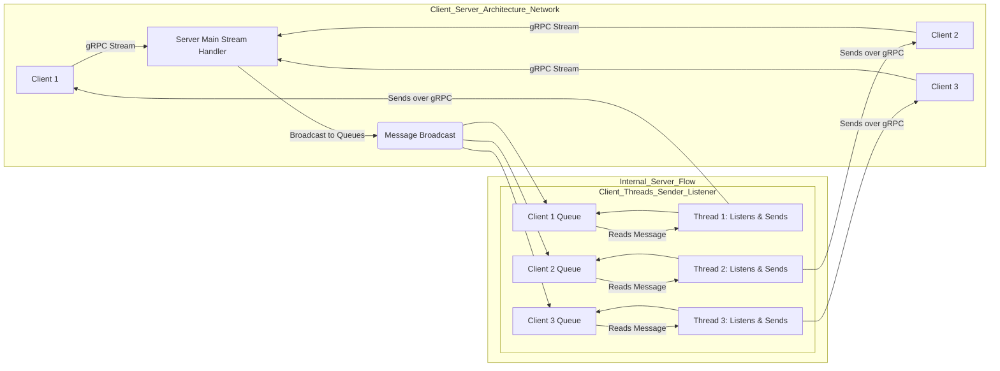

# gRPC Chatroom over Tailscale

## Overview

This project implements a secure, multi-client chatroom using Python gRPC bidirectional streaming.

Clients connect to a central server running on an Azure VM, and communicate in real-time. Access is controlled via token-based authentication.

All communication occurs over a private Tailscale VPN, allowing clients and server to communicate securely across devices without exposing the server to the public internet.

This solution demonstrates concepts in networking, client-server architecture, authentication, and secure communication over private networks.

## Features

- Multi-client chat with real-time message broadcasting
- Token-based authentication for access control
- Works over private network (Tailscale VPN)
- Supports Linux, Windows, WSL2, and mobile clients
- Thread-safe server using Python threading and queues
- Easily deployable on your own VM or physical machine

## 🛠️ System Requirements

- Python 3.12+
- pip / virtual environment support
- gRPC Python: grpcio, grpcio-tools
- Tailscale installed on server and client machines
- Ubuntu/Linux or WSL2 (Windows Subsystem for Linux)

## 💻 Server Setup & Architecture

### 1. Server Overview

The server is the central hub of the chat system:

- Listens for incoming client connections on port 50051.
- Authenticates users via a predefined token list.
- Manages multiple clients simultaneously using Python threads and message queues.
- Broadcasts messages sent by any client to all connected clients.

### 2. Internal Server Components

The server uses a robust, thread-safe architecture:

- **gRPC Service**: Implements a bidirectional streaming RPC, allowing the server to both receive and send messages asynchronously.
- **Threading**: Each connected client runs a separate thread that listens for incoming messages from that client.
- **Queue System**: Each client has a dedicated queue.Queue() object for messages. When any client sends a message, the server places it in all other clients' queues.
- **Authentication**: When a client connects, the server checks the provided token. Unauthorized users are disconnected.
- **Broadcast Loop**: A central loop continuously reads from each client's queue and sends messages back over the gRPC stream.

### Message Flow Diagram



### 3. How to Set Up Your Own Server

**Choose a Machine**: Use a cloud VM (Azure, AWS, GCP) or a physical Linux machine. Ensure it has Python 3.12+ installed.

**Install Dependencies**:

```bash
sudo apt update
sudo apt install python3-venv python3-pip -y
python3 -m venv venv
source venv/bin/activate
pip install grpcio grpcio-tools tailscale
```

**Set Up Tailscale VPN**:

```bash
sudo tailscale up --authkey=<your-auth-key>
tailscale status
```

This gives your server a private IP accessible by any machine on your Tailscale network.

**Place the Server Files**: Copy server.py and chat.proto to the server machine.

**Generate gRPC code**:

```bash
python -m grpc_tools.protoc -I. --python_out=. --grpc_python_out=. chat.proto
```

**Run the Server**:

```bash
python server.py
```

The server starts listening on port 50051.

### 4. Network Security Considerations

- Using Tailscale ensures the chat server is not exposed to the public internet.
- Token-based authentication prevents unauthorized users from joining.

## 📝 Using `chat.proto` to Start the gRPC Chatroom Server

### 1. What `chat.proto` Is

The `chat.proto` file is the protocol buffer definition that describes the messages and services for the chat application:

**Messages**: Define the data structure sent between server and clients. Example:

```protobuf
message Message {
    string user = 1;
    string text = 2;
}
```

**Services**: Define the gRPC service and RPC methods. Example:

```protobuf
service ChatService {
    rpc Join(stream Message) returns (stream Message);
}
```

The `Join` RPC is bidirectional streaming, allowing both server and client to continuously send and receive messages asynchronously.

### 2. How the Server Uses `chat.proto`

**Generate Python gRPC Code**:

From the server machine, run:

```bash
python -m grpc_tools.protoc -I. --python_out=. --grpc_python_out=. chat.proto
```

This generates:
- `chat_pb2.py` → Python classes for the messages
- `chat_pb2_grpc.py` → Python classes for the gRPC service stub and server

**`server.py` Uses These Files**:

Imports the generated classes:

```python
import chat_pb2
import chat_pb2_grpc
```

- Implements the `ChatServiceServicer` class, which contains the server-side logic for `Join`.
- Uses threads and queues to manage multiple clients and broadcast messages.

**Start the Server**:

```bash
python server.py
```

- The server listens on a chosen port (default `50051`)
- Prints connection events, messages, and disconnections

At this point, the server is ready to accept client connections over the network.

## 🔄 Recreating the Chatroom with Your Own Server

If someone wants to set up their own server and clients, using your `server.py`, `client.py`, and `chat.proto`:

### Step 1: Set Up a Server Machine

- Can be a cloud VM (Azure, AWS, GCP) or a physical Linux machine
- Ensure Python 3.12+ is installed

### Step 2: Install Dependencies

```bash
sudo apt update
sudo apt install python3-venv python3-pip -y
python3 -m venv venv
source venv/bin/activate
pip install grpcio grpcio-tools tailscale
```

### Step 3: Set Up Tailscale VPN

Install Tailscale on the server:

```bash
curl -fsSL https://tailscale.com/install.sh | sh
sudo tailscale up --authkey=<your-auth-key>
```

Check the server's Tailscale IP:

```bash
tailscale status
```

This private IP will be used by all clients to connect.

### Step 4: Place the Server Files

- Copy `server.py` and `chat.proto` to the server machine
- Generate Python gRPC code:

```bash
python -m grpc_tools.protoc -I. --python_out=. --grpc_python_out=. chat.proto
```

- Start the server:

```bash
python server.py
```

Server is now running and ready to accept connections from clients.

### Step 5: Set Up Client Machines

On each client (Linux, WSL2, Windows, or mobile):

**Install Python 3.12+ and virtual environment**:

```bash
sudo apt update
sudo apt install python3-venv python3-pip -y
python3 -m venv venv
source venv/bin/activate
```

**Install dependencies**:

```bash
pip install grpcio grpcio-tools tailscale
```

**Copy `client.py` and `chat.proto` to the client machine**

**Generate Python gRPC code**:

```bash
python -m grpc_tools.protoc -I. --python_out=. --grpc_python_out=. chat.proto
```

**Start Tailscale VPN on the client**:

```bash
sudo tailscale up --authkey=<client-auth-key>
tailscale status
```

**Run the client**:

```bash
python client.py
```

- Enter username and token
- Client connects to the server's Tailscale IP and starts chatting

## 🚀 Installation & Client Setup

### 1. Clone the Repository

```bash
git clone <your-repo-url>
cd grpc_chatroom
```

### 2. Setup Python Virtual Environment

```bash
python3 -m venv venv
source venv/bin/activate
```

### 3. Install Dependencies

```bash
pip install grpcio grpcio-tools
```

### 4. Generate gRPC Python Code from chat.proto

```bash
python -m grpc_tools.protoc -I. --python_out=. --grpc_python_out=. chat.proto
```

### 5. Start Tailscale VPN on Client

```bash
sudo tailscale up --authkey=<your-auth-key>
tailscale status
```

### 6. Run Client

```bash
python client.py
```

Enter a username and one of the predefined tokens (e.g., token1, token2, token3).

## 🗺️ Network Topology & Communication Flow

```
graph TD
    A[Client A: WSL2/Linux] -->|Tailscale VPN| S[Azure VM: gRPC Server]
    B[Client B: Windows PC] -->|Tailscale VPN| S
    C[Client C: Mobile/iOS] -->|Tailscale VPN| S
    S -->|Broadcast Messages| A
    S -->|Broadcast Messages| B
    S -->|Broadcast Messages| C
```

### Communication Flow Summary

1. Client connects → sends username + token.
2. Server validates token → accepts or denies connection.
3. Server setup → creates a unique queue and listener thread for the accepted client.
4. Client sends message → Server receives it and broadcasts it to all other connected clients' queues.
5. Clients receive messages → Each client's thread reads from its dedicated queue and sends the message back over the gRPC stream.

## 💡 Example Usage

### Server Output:

```sql
Server started on port 50051, waiting for clients...
User Alice connected with token token1
User Bob connected with token token2
User Charlie connected with token token3
User Alice disconnected
```

### Client Chat:

```yaml
Enter your username: Alice
Enter your token: token1
Alice: Hello everyone!
Bob: Hi Alice!
Charlie: Hey!
```

## 📚 Tools & Technologies

| Category | Technology | Purpose |
|----------|-----------|---------|
| Language | Python 3.12+ | Main programming language |
| Networking | gRPC (Python) | High-performance client-server communication |
| Security | Tailscale VPN | Private, secure network overlay |
| Server Host | Azure VM | Example cloud hosting for server |
| Architecture | Python threading & queue | Concurrent, thread-safe message handling |

## References

- [gRPC Python Documentation](https://grpc.io/docs/languages/python/)
- [Tailscale Documentation](https://tailscale.com/kb/)
- [Python Threading & Queue](https://docs.python.org/3/library/threading.html)
